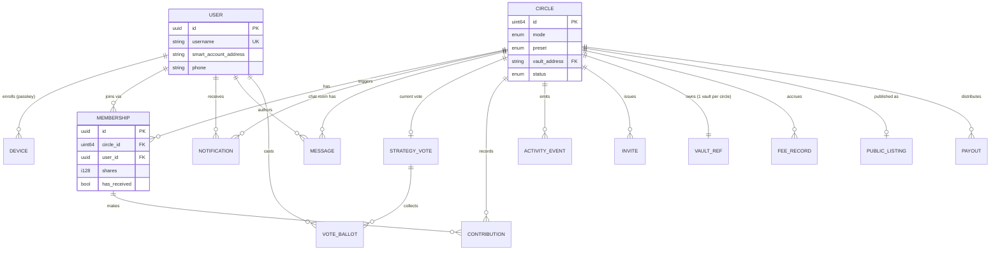

# Lindi — Data Model & ERD

> Technical companion to `LINDI-PRD.md`. The **single reference for every entity** across on-chain storage, the off-chain backend DB, and the DeFindex vault — plus how they relate (ERD), the share-mapping invariants, and the **mock-data → real-data** contract used to scaffold the frontend. Contract functions → `SMART-CONTRACTS.md`. Integrations → `INTEGRATIONS.md`.

| | |
|---|---|
| **Purpose** | Source of truth for data shapes. `packages/shared` types mirror this 1:1. Mock fixtures implement these types so swapping to real data is a data-source change, not a refactor. |
| **Three stores** | **On-chain** (Lindi Core, financial truth for rights) · **Off-chain DB** (social/UX) · **DeFindex vault** (pot value truth) |

---

## 1. Where Each Datum Lives (custody of truth)

**Rule:** anything that defines money or rights = on-chain. Anything social/UX-only = off-chain. The vault is the financial truth for *pot value*; Lindi Core is the truth for *who owns what fraction*.

| Concern | On-chain (Lindi Core) | Off-chain DB | DeFindex vault |
|---|---|---|---|
| Circle config & status | ✅ truth | cache/index | — |
| Member shares (rights) | ✅ truth | cache | vault holds totals |
| Pot value / yield | derived | cache | ✅ `total_assets`, price/share |
| Username ↔ address | — | ✅ truth | — |
| Passkey / device | on-chain (account) | ✅ public meta only | — |
| **PIN hash (fallback lock)** | — | **❌ never** | — · **device secure hardware only** (Keychain/Keystore); Argon2id+salt; never in DB or synced (ARCHITECTURE §3.1, D17) |
| Interest tags / tier / cap | `tier_min`,`cap` on-chain · tags off-chain | ✅ tags truth | — |
| Reputation **[PROD]** | derived from events | ✅ materialized view | — |
| Goal label/amount/date | ✅ (label `Bytes`) | mirror (search) | — |
| Vote tally | ✅ truth | mirror | — |
| Chat / discussion | — | ✅ truth | — |
| Notifications | — | ✅ truth | — |
| Invites | — | ✅ truth | — |
| Activity feed | sourced from events | ✅ materialized | — |
| Fees collected | charged by vault | ✅ recorded | ✅ on yield |

---

## 2. Entity-Relationship Diagram



> The diagram shows the **logical** model spanning stores. `USER`, `DEVICE`, `MESSAGE`, `NOTIFICATION`, `INVITE`, `PUBLIC_LISTING`, `ACTIVITY_EVENT` are **off-chain**. `CIRCLE`, `MEMBERSHIP` (as Member), `STRATEGY_VOTE`, `CONTRIBUTION`, `PAYOUT`, `FEE` are **on-chain truths mirrored off-chain**. `VAULT_REF` points at the DeFindex vault.

---

## 3. Relationship & Cardinality Reference

| From | Rel | To | Cardinality | Notes |
|---|---|---|---|---|
| User | enrolls | Device | 1 : N | multiple passkeys/devices per user (backup device) |
| User | joins | Membership | 1 : N | a user is in many circles |
| Circle | has | Membership | 1 : N | a circle has many members |
| User ↔ Circle | via Membership | — | M : N | join table = Membership |
| Circle | owns | VaultRef | 1 : 1 | **exactly one DeFindex vault per circle** (keeps share math exact) |
| Circle | current | StrategyVote | 1 : 0..1 | at most one open vote at a time |
| StrategyVote | collects | VoteBallot | 1 : N | one ballot per member |
| Membership | makes | Contribution | 1 : N | many rounds |
| Circle | emits | ActivityEvent | 1 : N | materialized from chain events |
| Circle | chat | Message | 1 : N | off-chain room |
| User/Circle | triggers | Notification | 1 : N | fan-out |
| Circle | issues | Invite | 1 : N | closed circles only |
| Circle | published as | PublicListing | 1 : 0..1 | PUBLIC_POOL mode only |
| Circle | distributes | Payout | 1 : N | rounds (CLASSIC) / final (GOAL) |
| Circle | accrues | FeeRecord | 1 : N | yield-fee + penalty events |

---

## 4. On-Chain Entities (Lindi Core — Soroban storage)

Mirrors `SMART-CONTRACTS.md` §2. Field types are Soroban (`i128`, `u64`, `Address`, `Bytes`, `Option`).

### Circle
| Field | Type | Modes | Notes |
|---|---|---|---|
| `id` | u64 | all | PK |
| `mode` | Mode | all | `ClassicRotating \| GoalBased \| PublicPool` |
| `creator` | Address | all | seed depositor |
| `asset` | Address | all | deposit asset SAC (testnet USDC) |
| `vault` | Address | all | this circle's DeFindex vault (1:1) |
| `preset` | Preset | all | `Conservative \| Balanced \| Growth` |
| `order` | Order | CLASSIC | `ByOrder \| RandomNoRepeat \| Bid` |
| `contribution_amount` | i128 | CLASSIC, GOAL | per round |
| `round_duration` | u64 | CLASSIC, GOAL | ledgers/seconds |
| `total_rounds` | u32 | CLASSIC, GOAL | |
| `current_round` | u32 | CLASSIC, GOAL | |
| `auto_compound` | bool | all | PRD §8.8 |
| `goal_label` | Option<Bytes> | GOAL | user text ("Umroh") |
| `goal_amount` | Option<i128> | GOAL | |
| `goal_date` | Option<u64> | GOAL | |
| `goal_changed` | bool | GOAL | change-once guard |
| `published` | bool | PUBLIC | discoverable in Discover feed (D16) |
| `tier_min` | i128 | PUBLIC | minimum deposit (commitment tier); 0 = none |
| `cap` | Option<i128> | PUBLIC | optional max pool size; over-cap deposits rejected atomically (SMART-CONTRACTS §11.1) |
| `status` | CircleStatus | all | `Forming \| Active \| Completed \| Defaulted` |

### Member (keyed `(circle_id, address)`)
| Field | Type | Notes |
|---|---|---|
| `addr` | Address | smart-account address |
| `total_contributed` | i128 | principal sum (penalty floor) |
| `shares` | i128 | vault shares owned by this member |
| `has_received` | bool | CLASSIC: already won pot |
| `collateral_locked` | i128 | default backstop |
| `active` | bool | false = defaulted/exited |

### Pot (keyed `circle_id`)
| Field | Type | Notes |
|---|---|---|
| `vault_shares_total` | i128 | Σ member.shares (invariant) |
| `current_round` | u32 | |
| `payout_order` | Vec<Address> | CLASSIC resolved order |
| `winners` | Vec<Address> | RandomNoRepeat exclusion set |

### StrategyVote (keyed `circle_id`)
| Field | Type | Notes |
|---|---|---|
| `proposed` | Preset | |
| `votes` | Map<Address,bool> | one per member |
| `quorum` | u32 | |
| `resolved` | bool | |

### Config (instance)
| Field | Type | Notes |
|---|---|---|
| `admin` | Address | |
| `min_seed` | i128 | mandatory vault seed floor (Q11) |
| `default_fee_bps` | u32 | Lindi fee on yield (≤9000) |
| `penalty_params` | PenaltyParams | dynamic curve config (YIELD-ENGINE §5) |
| `allowed_asset` | Address | asset allowlist |

---

## 5. Off-Chain Entities (backend DB — Postgres)

> These hold **no fund custody**. Private keys never stored — they live in device secure hardware (smart-account-kit). The DB stores public addresses + non-secret metadata + social/UX data + materialized mirrors of chain state for fast reads.

### User
| Field | Type | Notes |
|---|---|---|
| `id` | uuid | PK |
| `username` | string | **UNIQUE** — the identity surfaced everywhere (PRD §8.6) |
| `smart_account_address` | string | on-chain account address |
| `phone` | string | onboarding + WhatsApp; unique |
| `display_name` | string? | optional friendly name |
| `avatar_url` | string? | falls back to orb |
| `locale` | enum | `id \| en` (default `id`) |
| `created_at` / `updated_at` | timestamptz | |

### Device  (passkey, public metadata only)
| Field | Type | Notes |
|---|---|---|
| `id` | uuid | PK |
| `user_id` | uuid | FK → User |
| `credential_id` | string | WebAuthn credential id (public) |
| `public_key` | string | P256 public key (public) |
| `label` | string | "iPhone 14", "backup" |
| `is_backup` | bool | recovery device |
| `last_used_at` | timestamptz | |

> **No PIN field here or anywhere in the DB.** The 6-digit PIN fallback (D17) is hashed (Argon2id + per-device salt) and stored **only in device secure hardware** (Keychain/Keystore) — never in this table, never synced, never on the backend. The backend knows a device exists (public passkey meta), not how it's locked. Spec: ARCHITECTURE §3.1.

### CircleIndex  (materialized mirror of on-chain Circle, for fast reads/search)
| Field | Type | Notes |
|---|---|---|
| `circle_id` | uint64 | PK (matches on-chain id) |
| `mode` | enum | mirror |
| `preset` | enum | mirror |
| `status` | enum | mirror |
| `name` | string | display name (off-chain) |
| `goal_label` | string? | mirror (searchable) |
| `goal_amount` | numeric? | mirror |
| `goal_date` | date? | mirror |
| `is_public` | bool | PUBLIC_POOL → shown in discovery feed |
| `tags` | text[] | denormalized from PublicListing for feed filtering (D16) |
| `tier_min` | numeric | PUBLIC: minimum deposit (display/sort) |
| `cap` | numeric? | PUBLIC: max pool size |
| `vault_address` | string | FK → vault |
| `cached_pot_value` | numeric | from vault read (USDC) |
| `cached_pot_value_idr` | numeric | via Reflector (or hardcoded MVP) |
| `cached_apy` | numeric | live blended APY, TTL |
| `member_count` | int | |
| `synced_at` | timestamptz | last chain sync |

### MembershipIndex  (mirror of on-chain Member + off-chain link)
| Field | Type | Notes |
|---|---|---|
| `id` | uuid | PK |
| `circle_id` | uint64 | FK → CircleIndex |
| `user_id` | uuid | FK → User |
| `shares` | numeric | mirror |
| `total_contributed` | numeric | mirror |
| `has_received` | bool | CLASSIC mirror |
| `collateral_locked` | numeric | mirror |
| `payout_position` | int? | CLASSIC order index |
| `role` | enum | `creator \| member` |
| `active` | bool | |
| `joined_at` | timestamptz | |

### Invite  (closed circles)
| Field | Type | Notes |
|---|---|---|
| `id` | uuid | PK |
| `circle_id` | uint64 | FK |
| `inviter_user_id` | uuid | FK → User |
| `invitee_username` | string? | by username |
| `invitee_phone` | string? | by contact |
| `code` | string | shareable deep-link token |
| `status` | enum | `pending \| accepted \| declined \| expired` |
| `expires_at` | timestamptz | |

### PublicListing  (PUBLIC_POOL discovery)
| Field | Type | Notes |
|---|---|---|
| `id` | uuid | PK |
| `circle_id` | uint64 | FK (unique — 0..1 per circle) |
| `headline` | string | "Open USD savings — Conservative" |
| `description` | string? | |
| `cover_url` | string? | |
| `tags` | text[] | **interest/goal tags** powering the Discover feed (D16); curated + free-form |
| `tier_min` | numeric | mirror of on-chain `tier_min` (display/filter) |
| `cap` | numeric? | mirror of on-chain `cap` |
| `published_by` | uuid | FK → User |
| `is_active` | bool | |
| `published_at` | timestamptz | |

### PoolTag  (curated tag vocabulary for Discover; optional, for autocomplete/filtering)
| Field | Type | Notes |
|---|---|---|
| `slug` | string | PK — `umroh`, `anak-sekolah`, `modal-usaha`, `lebaran` |
| `label_id` | string | Bahasa label |
| `label_en` | string | English label |
| `usage_count` | int | popularity for ranking |

### ReputationScore  **[PROD]**  (social identity backbone — PRD §21.4.1)
| Field | Type | Notes |
|---|---|---|
| `user_id` | uuid | PK/FK → User |
| `circles_completed` | int | derived from on-chain completion history |
| `circles_defaulted` | int | derived from `Defaulted` events |
| `on_time_rate` | numeric | contributions on time / total |
| `score` | numeric | composite; gates higher-tier pools |
| `computed_at` | timestamptz | derived, recomputed from chain events |

> **[PROD]** — not built for MVP. Derived **entirely** from on-chain events (completion/default/contribution), so it carries no independent custody/truth — it's a materialized social view. Doubles as the anti-default reputation gate (SMART-CONTRACTS §6) and the discovery trust signal.

### Message  (off-chain group chat / discussion room)
| Field | Type | Notes |
|---|---|---|
| `id` | uuid | PK |
| `circle_id` | uint64 | FK |
| `author_user_id` | uuid | FK → User |
| `kind` | enum | `text \| system \| vote_prompt \| milestone` (PRD §12.9) |
| `body` | string | |
| `meta` | jsonb? | e.g. `{ voteId }` for `vote_prompt`; `{ activityEventId, eventType }` for `system`; `{ pct, goalLabel }` for `milestone` |
| `created_at` | timestamptz | |

> **Chat = circle room feed (PRD §12.9).** `system` messages are **projections of on-chain `ActivityEvent`s** (contributions, payouts, rebalances, milestones) interleaved with human `text` by timestamp — the feed and the chat are one surface, not two. `vote_prompt` renders an inline tappable vote card (links a `StrategyVoteMirror` via `meta.voteId`). Off-chain only (no custody). **Public pools default to announcements-first** (publisher posts + reactions); full member chat + moderation are [PROD].

### Notification
| Field | Type | Notes |
|---|---|---|
| `id` | uuid | PK |
| `user_id` | uuid | FK → User (recipient) |
| `circle_id` | uint64? | FK (nullable for account-level) |
| `type` | enum | `contribution_due \| contribution_received \| payout_ready \| pot_grew \| vote_open \| vote_resolved \| goal_reached \| default_alert \| invite \| early_exit_proposed` |
| `title` | string | localized |
| `body` | string | localized |
| `channel` | enum | `push \| whatsapp \| in_app` |
| `payload` | jsonb? | deep-link target |
| `read_at` | timestamptz? | null = unread |
| `sent_at` | timestamptz | |

### StrategyVoteMirror + VoteBallot  (mirror of on-chain vote for UI)
**StrategyVoteMirror**
| Field | Type | Notes |
|---|---|---|
| `id` | uuid | PK |
| `circle_id` | uint64 | FK |
| `proposed_preset` | enum | |
| `proposed_by` | uuid | FK → User |
| `quorum` | int | |
| `status` | enum | `open \| resolved \| rejected` |
| `resolved_preset` | enum? | |
| `opened_at` / `resolved_at` | timestamptz | |

**VoteBallot**
| Field | Type | Notes |
|---|---|---|
| `id` | uuid | PK |
| `vote_id` | uuid | FK → StrategyVoteMirror |
| `voter_user_id` | uuid | FK → User |
| `approve` | bool | |
| `tx_hash` | string | on-chain ballot tx |
| `cast_at` | timestamptz | |

> The same ballot pattern is reused for **early-exit votes** and **change-goal votes** (both unanimous) via a `vote_kind` discriminator: `strategy \| early_exit \| change_goal`.

### ContributionMirror
| Field | Type | Notes |
|---|---|---|
| `id` | uuid | PK |
| `circle_id` | uint64 | FK |
| `user_id` | uuid | FK |
| `round` | int | |
| `amount` | numeric | USDC |
| `shares_minted` | numeric | from vault |
| `tx_hash` | string | |
| `created_at` | timestamptz | |

### PayoutMirror
| Field | Type | Notes |
|---|---|---|
| `id` | uuid | PK |
| `circle_id` | uint64 | FK |
| `round` | int? | CLASSIC round; null for GOAL final |
| `recipient_user_id` | uuid? | CLASSIC; null for split |
| `kind` | enum | `classic_rotation \| goal_final \| public_withdraw \| early_exit` |
| `amount` | numeric | |
| `yield_portion` | numeric | for "total yield earned" UI |
| `penalty_applied` | numeric | early-exit only |
| `tx_hash` | string | |
| `created_at` | timestamptz | |

### FeeRecord
| Field | Type | Notes |
|---|---|---|
| `id` | uuid | PK |
| `circle_id` | uint64 | FK |
| `kind` | enum | `yield_fee \| early_exit_penalty \| platform_fee` |
| `gross_yield` | numeric? | basis for yield_fee |
| `amount` | numeric | Lindi's share |
| `defindex_share` | numeric? | ~20% cut (yield_fee) |
| `tx_hash` | string? | |
| `created_at` | timestamptz | |

### ActivityEvent  (materialized feed = the transparent ledger UI)
| Field | Type | Notes |
|---|---|---|
| `id` | uuid | PK |
| `circle_id` | uint64 | FK |
| `event_type` | enum | mirrors contract events (`SMART-CONTRACTS.md` §10) |
| `actor_user_id` | uuid? | FK |
| `data` | jsonb | event payload |
| `ledger` | int | source ledger |
| `tx_hash` | string | |
| `occurred_at` | timestamptz | |

### VaultRef  (pointer + cached vault metrics; truth lives in DeFindex)
| Field | Type | Notes |
|---|---|---|
| `vault_address` | string | PK |
| `circle_id` | uint64 | FK (unique) |
| `strategies` | jsonb | `[{address, allocBps}]` |
| `total_assets` | numeric | cached from `getVault` |
| `total_supply` | numeric | cached |
| `price_per_share` | numeric | derived |
| `manager` | string | = Lindi Core contract (contract-as-manager) |
| `fee_bps` | int | Lindi yield fee (≤9000) |
| `synced_at` | timestamptz | |

---

## 6. The Share Mapping (the crux — keep exact)

```
member.shares            ── Lindi Core, per member
pot.vault_shares_total   ── Lindi Core, per circle   == Σ member.shares      (INVARIANT 1)
vault.total_supply       ── DeFindex                  == pot.vault_shares_total (one vault/circle)
vault.total_assets       ── DeFindex                  (grows with yield)
price_per_share          ── total_assets / total_supply
```
- Member USD value = `member.shares × price_per_share`.
- Member yield = `value − member.total_contributed` (≥ 0 normally).

**Invariants to assert (contract tests):**
1. `pot.vault_shares_total == Σ member.shares`
2. `member.shares ≥ 0`, `member.total_contributed ≥ 0`
3. on withdraw/penalty: `payout ≤ member.shares × price_per_share`
4. on penalty: `penalty ≤ (value − total_contributed)` — **yield only, principal untouchable**

> One-vault-per-circle is what keeps `vault.total_supply == pot.vault_shares_total` (modulo the seed/fee shares). Do not share a vault across circles.

---

## 7. Enums (canonical — reuse everywhere)

```ts
enum CircleMode    { CLASSIC_ROTATING, GOAL_BASED, PUBLIC_POOL }
enum Preset        { CONSERVATIVE, BALANCED, GROWTH }
enum ClassicOrder  { BY_ORDER, RANDOM_NO_REPEAT, BID }
enum CircleStatus  { FORMING, ACTIVE, COMPLETED, DEFAULTED }
enum MemberRole    { CREATOR, MEMBER }
enum VoteKind      { STRATEGY, EARLY_EXIT, CHANGE_GOAL }
enum VoteStatus    { OPEN, RESOLVED, REJECTED }
enum PayoutKind    { CLASSIC_ROTATION, GOAL_FINAL, PUBLIC_WITHDRAW, EARLY_EXIT }
enum FeeKind       { YIELD_FEE, EARLY_EXIT_PENALTY, PLATFORM_FEE }
enum NotifType     { CONTRIBUTION_DUE, CONTRIBUTION_RECEIVED, PAYOUT_READY, POT_GREW,
                     VOTE_OPEN, VOTE_RESOLVED, GOAL_REACHED, DEFAULT_ALERT, INVITE, EARLY_EXIT_PROPOSED }
enum Channel       { PUSH, WHATSAPP, IN_APP }
enum Locale        { ID, EN }
```

---

## 8. Mock Data → Real Data Contract

The frontend scaffolds against mock fixtures **shaped exactly like the TS types** generated from this model. Swapping to real data = swapping the data source, not editing components.

### 8.1 Type location
- Canonical TS types live in `packages/shared/src/models/*.ts`, **mirroring §4–§5 1:1**.
- Both mock fixtures and real API responses satisfy these types.
- Any new field → update this doc + `packages/shared` first, then mock, then UI.

### 8.2 Shape (illustrative TS — keep in sync with tables above)
```ts
// packages/shared/src/models/circle.ts
export interface Circle {
  id: number;
  mode: CircleMode;
  preset: Preset;
  order?: ClassicOrder;
  status: CircleStatus;
  name: string;
  goalLabel?: string;
  goalAmount?: string;     // decimal-as-string (avoid float money)
  goalDate?: string;       // ISO date
  isPublic: boolean;
  tags?: string[];         // PUBLIC: interest/goal tags (Discover feed, D16)
  tierMin?: string;        // PUBLIC: minimum deposit (decimal-as-string)
  cap?: string;            // PUBLIC: optional max pool size
  vaultAddress: string;
  potValue: string;        // USDC
  potValueIdr: string;
  apy: number;             // live blended
  autoCompound: boolean;
  memberCount: number;
  members: Membership[];
}

export interface Membership {
  id: string;
  userId: string;
  username: string;        // denormalized for display
  shares: string;
  totalContributed: string;
  hasReceived: boolean;
  payoutPosition?: number;
  role: MemberRole;
  active: boolean;
}
```
> **Money as strings.** Represent all amounts as decimal strings (or minor-unit bigints), never JS `number` — floats corrupt money. UI formats for display.

### 8.3 Data source interface (swap point)
```ts
// one interface; two implementations (mock | live). UI depends only on this.
export interface LindiDataSource {
  getCircle(id: number): Promise<Circle>;
  listMyCircles(userId: string): Promise<Circle[]>;
  // Discover feed (D16): filter by interest tags / tier; sort by size/apy/recency
  listPublicPools(filter?: { tags?: string[]; tierMax?: string; sort?: 'size' | 'apy' | 'recent' }): Promise<Circle[]>;
  getActivity(circleId: number): Promise<ActivityEvent[]>;
  getMessages(circleId: number): Promise<Message[]>;          // circle room feed (PRD §12.9)
  sendMessage(circleId: number, body: string): Promise<Message>; // text only; system msgs are server-projected
  getNotifications(userId: string): Promise<Notification[]>;
  getReputation?(userId: string): Promise<ReputationScore>; // [PROD] optional until built
  // writes return prepared txs for client signing (ARCHITECTURE §4)
  buildContribute(circleId: number, round: number, amount: string): Promise<PreparedTx>;
}
```
Mock impl returns fixtures; live impl reads chain/indexer/DB. Components never know which.

### 8.4 Fixture rule
- One fixtures file per entity in `apps/mobile/mocks/` (or `packages/shared/mocks`).
- Cover the demo states: forming circle, active goal mid-progress, completed with yield, a default event, a public pool, an open vote, unread notifications.
- Money values realistic (Rp / USDC) so UI spacing is tested against real magnitudes.

---

## 9. Circle Lifecycle (status state machine)

```
Forming ──create_circle(seed)──▶ Active
Active ──all rounds done / goal met──▶ Completed
Active ──unanimous early exit (penalty)──▶ Completed
Active ──default unrecoverable──▶ Defaulted
PublicPool: stays Active (open deposit/withdraw) until creator closes
```

---

## 10. Indexing & Sync

- On-chain events (`SMART-CONTRACTS.md` §10) → indexer (Mercury/Zephyr; RPC `getEvents` fallback) → materialize into `ActivityEvent`, and update `CircleIndex` / `MembershipIndex` / `VaultRef` caches.
- `cached_*` fields carry a `synced_at`; stale beyond TTL → re-read from chain/vault before display-critical use.
- Off-chain-only tables (Message, Notification, Invite, PublicListing) have no chain mirror.

---

## 11. Open Data Questions (mirror PRD §22)

- **Q11** `min_seed` value (mandatory vault seed at creation).
- **Goal label** on-chain `Bytes` (transparent) vs hash-on-chain + text off-chain (cheaper). Recommend short `Bytes` on-chain.
- **Vote storage** persistent vs temporary (TTL) on-chain — temporary cheaper if resolved votes archived via events + off-chain mirror.
- **Money representation** confirm decimal-string everywhere in `packages/shared` (no floats).
- **Q9** Public-pool governance fields (publisher-set vs open vote) — affects whether `StrategyVoteMirror` applies to PUBLIC_POOL.
